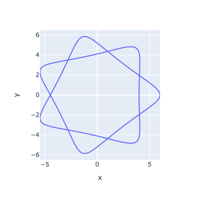

# spirograph

```
curl -sSf https://rye-up.com/get | bash
source "$HOME/.rye/env"
rye sync

python main.py
# If you want to execute with notebook, please execute main.ipynb
```

# Example
r_f = 7, r_r = 2, r_d = 1  
